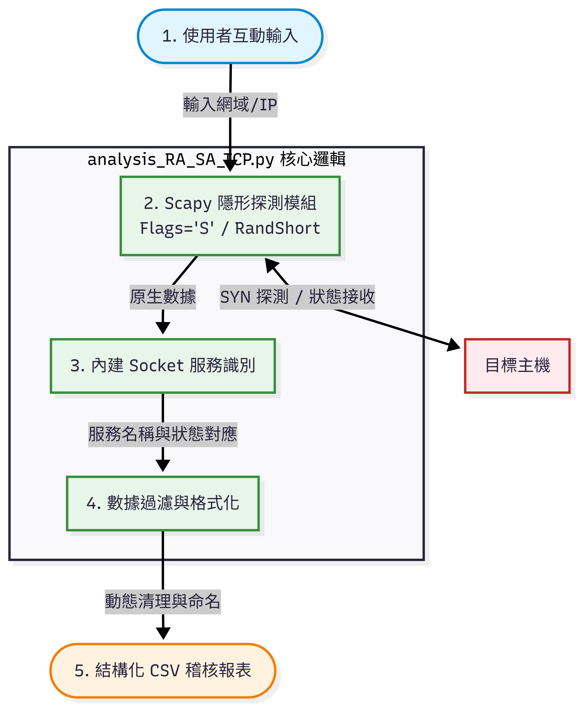
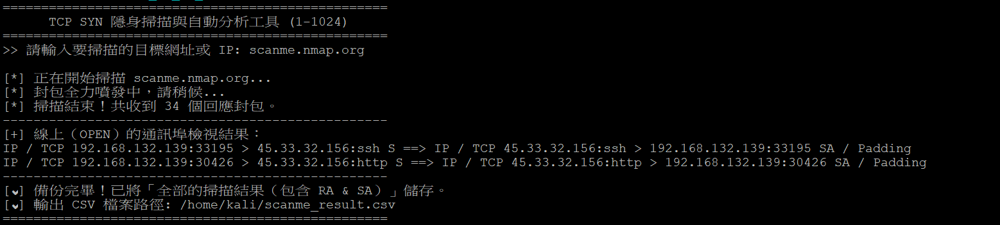
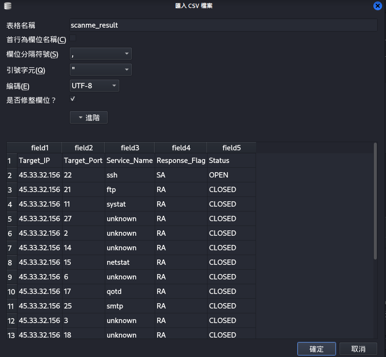

# TCP SYN 隱形掃描與網路服務自動化分析工具

本專題基於 Python Scapy 框架，從底層網路通訊協定出發，手刻實現原生 TCP SYN 隱形掃描（Stealth Scan）核心邏輯，並結合自動化資料處理，將探測結果結構化輸出為審查報表。

## 實際執行畫面
工具採用互動式命令列介面設計，使用者輸入目標網域或 IP 後，系統將自動封裝並發送探測封包，即時過濾並動態檢視線上（OPEN）的通訊埠狀態：



## 結構化 CSV 報告輸出
掃描結束後，工具會自動清理網域字串雜訊，動態命名並導出完整的標準 CSV 稽核報表，全面記錄 1-1024 範圍內所有埠口的連線狀態（OPEN / CLOSED / FILTERED）與相對應的系統服務名稱：



## 核心功能
* **底層封包自定義**：不依賴現成工具（如 Nmap），直接操作 `IP()` 與 `TCP()` 欄位結構進行封包封裝。
* **隱形探測（SYN Scan）**：利用 TCP 三向交握不完整連線特性，探測目標埠口且不易觸發高層應用程式日誌。
* **自動化服務識別**：結合 Python 內建 `socket` 模組，動態解析 1-1024 常用埠口的系統服務名稱，避開框架版本相容性痛點。
* **結構化 I/O 備份**：自動過濾無效雜訊，將動態探測數據格式化導出為標準 CSV 稽核報表（包含 Target_IP, Target_Port, Service_Name, Response_Flag, Status）。

## 執行環境與操作步驟
本工具需在 Linux（如 Kali Linux）環境下以管理員權限執行：

```bash
# 1. 賦予執行權限
chmod +x analysis_RA_SA_TCP.py

# 2. 執行掃描工具
sudo ./analysis_RA_SA_TCP
